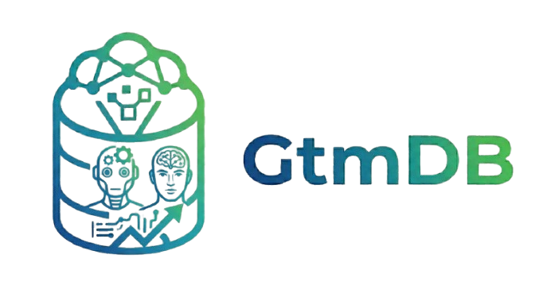

<p align="center">
  <a href="https://github.com/tomerfri12/gtm-db" title="gtmDB">
    
  </a>
</p>

<h1 align="center">gtmDB</h1>

<p align="center">
  <strong>Graph-native CRM / GTM data layer</strong> — Neo4j, policy-scoped API keys, FastAPI REST, async Python SDK.
</p>

---

## Overview — what is gtmDB?

**GtmDB** is the **full-stack data layer** built for the era of GTM autonomous operations. While many agentic stacks rely on scattered data and rigid tables without a clear permission story, gtmDB — backed by **graph-native storage** — gives agents and humans **typed CRUD, traversals, and search** over the commercial graph under a single **scope** model. Whether your agents run on OpenAI, Claude, LangGraph, or similar, gtmDB provides **secure access** to accounts, leads, contacts, deals, campaigns, and related entities so they can act on **one source of truth**.

**For integrations**, use the **REST API** (`GET /health`, `/v1/*`). Run the server with `python -m gtmdb serve`; interactive docs live at `/docs`. The same behavior is available in-process via the **`GtmDB`** Python client.

### What gtmDB supports

- **One system of record for GTM — and the agents that use it.** Typed CRUD and graph traversals over accounts, leads, contacts, deals, campaigns, email programs, scores, channels, products, content, and relationships — so one store can back MCP servers, LangChain-style tools, and agent stacks instead of re-wrapping a different partial API per system.
- **Security and permissions out of the box.** Every call runs under a `Scope` tied to declarative policies: tenant isolation, read/write rules, field-level masking, and redaction. Different tokens for reps, internal agents, or partners.
- **Automation-friendly.** Design your stack so events in gtmDB can drive downstream workflows (e.g. deal closed, campaign sent).
- **Exploratory and analytical questions** on the same CRM-native store — funnels, attribution-style paths, 360° views — not a separate BI silo for every question.

### Sales, marketing & customer success — one system of record

The entity model is **cross-functional**: the same graph holds what **marketing**, **sales**, and **customer success** care about, so gtmDB can serve as the **system of record for the whole revenue motion** — not three disconnected spreadsheets or siloed tools.

| Function | In the graph |
|----------|----------------|
| **Marketing** | Campaigns, leads, attribution (`SOURCED_FROM`, `INFLUENCED`), channels, content, full-text search tied to the same pipeline sales uses. |
| **Sales** | Accounts, contacts, deals, traversals (entity 360°, explore subgraph) for account planning. |
| **Customer success** | Same account graph for tickets, health, renewals (roadmap entities); timeline from comms and notes so teams share one customer truth. |
| **RevOps** | One permission model, one API — fewer shadow CRMs. |

Under the hood, entities live as **nodes and relationships in Neo4j**. Optional **Postgres** backs **agent API keys** when `GTMDB_KEY_STORE_URL` is set.

---

## Quick start

1. Copy `.env.example` to `.env` and set **Neo4j** credentials, optional **`GTMDB_KEY_STORE_URL`**, and **`GTMDB_ADMIN_KEY`**.
2. Install: `pip install -e ".[dev]"` (use a virtualenv).
3. Bootstrap schema: `python -m gtmdb init` (admin key required).
4. Run API: `python -m gtmdb serve` — defaults to port **8100**; on Railway use **`PORT`**.

- **OpenAPI / Swagger:** `http://localhost:8100/docs`
- **Static API reference (logo + deep docs):** [docs/api-reference.html](docs/api-reference.html)

## Auth

- `Authorization: Bearer <key>` on all `/v1/*` routes.
- Admin key = `GTMDB_ADMIN_KEY` (full access + `/v1/admin/keys`).
- Agent keys = stored in Postgres when `GTMDB_KEY_STORE_URL` is set.

## A2A (Agent-to-Agent) Analyst

The API exposes **A2A protocol v0.3** alongside REST:

- **Agent Card:** `GET /.well-known/agent-card.json` (public discovery).
- **JSON-RPC:** `POST /v1/a2a` — same `Authorization: Bearer` token as `/v1` (admin or Postgres-backed agent key). Streaming is supported (`message/stream`); the analyst emits task artifact chunks (JSON lines) for plan / step / result / answer / done, then completes with the final answer.

Set **`GTMDB_PUBLIC_URL`** to your public API origin when the service is not behind a proxy that sends `Host` / `X-Forwarded-Host` (that value wins if set). Otherwise the Agent Card infers the JSON-RPC `url` from those headers on each `GET /.well-known/agent-card.json`. For manual checks, use the [A2A samples](https://github.com/a2aproject/a2a-samples) client or inspector tooling compatible with spec 0.3.

Remote agents need a **Bearer token** identical to REST (`GTMDB_ADMIN_KEY` or a Postgres-backed agent key from `/v1/admin/keys`); share keys through your normal secret channel, not in the Agent Card.

## Deploy (Railway)

1. Create a **Railway** project, connect this GitHub repo.
2. Add **Postgres**; set `GTMDB_KEY_STORE_URL` to the `postgresql+asyncpg://…` URL Railway provides.
3. Set `GTMDB_NEO4J_*`, `GTMDB_ADMIN_KEY`, and point Neo4j to your **Aura** (or other) instance.
4. Railway injects **`PORT`** — the CLI `serve` command reads it automatically.

## Python library

```python
from gtmdb import connect_gtmdb

db, scope = await connect_gtmdb(api_key="…")
await db.leads.create(scope, actor_id="agent-1", company_name="Acme", status="new")
await db.close()
```

## License

Proprietary / as per repository owner.
